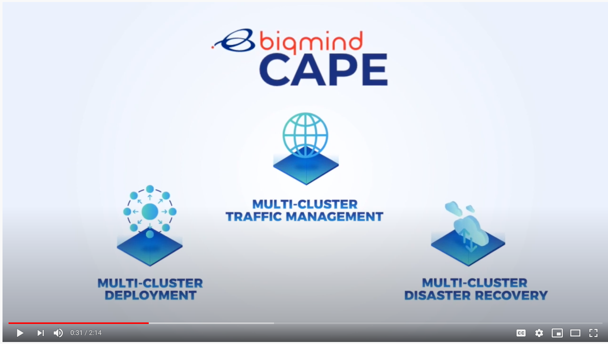

# CAPE

<p align="center" style="background-color:#23327c"></p>


`CAPE` is a multi cluster application and data management tool.

## Project Status

As of v1.0.0, CAPE is in the beta phase. Check out the
[Relase Notes][6] for more details 


## Documentation / User Guides

All user documentation is available at the [CAPE docs website](https://docs.cape.sh/docs/).

## CAPE in Action
[](https://youtu.be/4KJt8NXTO8E "CAPE INTRO")

## Features

* Multi-Cluster Data management
* Multi-Cluster Application management

<hr /> 

## Installing CAPE

### Downloading a binary from GitHub Releases  
#### Start k3d local instance
Prerequisites: [docker](https://docs.docker.com/get-docker/), [k3d](https://github.com/rancher/k3d)
```sh
k3d create -n dev -p 80:80 -p 443:443 --wait=0
export KUBECONFIG="$(k3d get-kubeconfig --name='dev')"
kubectl cluster-info
````

#### Installing CAPE
> Enter the following command:
```
kubectl apply -f https://cape.sh/install/simple.yaml
```

#### Accessing CAPE UI
> Enter the following command:
```
kubectl -n cape wait --for=condition=available --timeout=600s deployment/web
#wait for completion of CAPE deployment
open http://127.0.0.1.nip.io
```
<hr />

## Kubernetes Versions Compatibility


| CAPE Version | 1.18 | 1.17 | 1.16 | 1.15 | 1.14  | Supported providers|
| --------------- | ---- | ---- | ---- | ---- | ----  | -----------------|
| v1.0.0        | +    | +    | +    | +    | -        | AWS, DigitalOcean, GCE,  |
| v1.0.0        | -    | -    | +    | +    | +        | AWS, DigitalOcean, GCE,  |

## Getting Started

We have a getting started tutorial in our docs
[https://docs.cape.sh/docs/simple-install][10]


## Getting Involved

We very appreciate your feedback and participation.

If you want to get in touch with us and discuss about improvements and new
features, please create a new issue on GitHub or connect with us over the
mailing list or Slack:

* [CAPE mailing list][14] TBD
* [`#general` channel][5] TBD

## Reporting Bugs

If you encounter issues, please [create a new issue on GitHub][1] or talk to us
on the [`#general` Slack channel][5]. When reporting a bug please include the
following information:


If you're reporting a security vulnerability, please follow
[the process for reporting security issues][16].

## Changelog

See [the list of releases][3] to find out about feature changes.

[1]: https://github.com/biqmind/cape/issues/new
[13]: https://github.com/biqmind/cape#features
[14]: https://groups.google.com/forum/#!forum/biqmind-cape
[15]: http://capesh.slack.io/
[16]: https://github.com/biqmind/cape/blob/master/CONTRIBUTING.md#reporting-a-security-vulnerability

